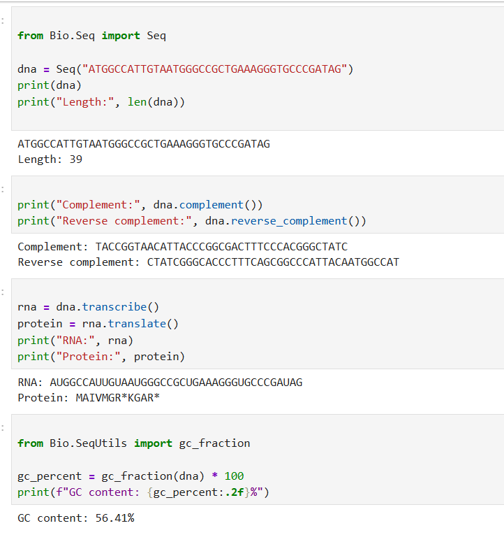
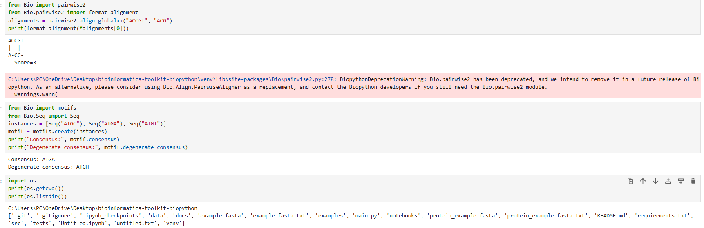
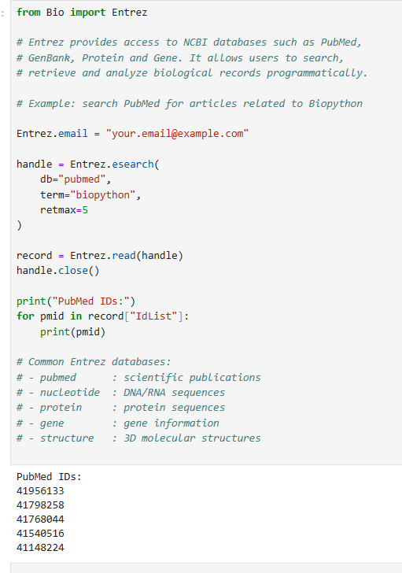
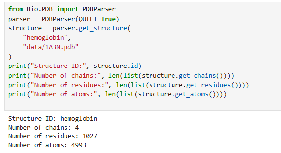

# Bioinformatics Toolkit with Biopython


A Python-based bioinformatics toolkit demonstrating practical applications of Biopython for sequence analysis, biological file parsing, motif discovery, protein structure analysis, and access to public biological databases.

---
## Project Highlights

✔ DNA, RNA, and protein sequence analysis

✔ FASTA and GenBank parsing

✔ GC content calculation and visualization

✔ Pairwise sequence alignment

✔ Motif discovery and consensus sequence generation

✔ NCBI Entrez database integration

✔ Protein structure analysis using PDB files

✔ Unit testing with pytest

✔ Reproducible bioinformatics workflows

---

## Features

- DNA sequence analysis
- FASTA and GenBank parsing
- Protein sequence analysis
- GC content calculation and visualization
- Pairwise sequence alignment
- Motif detection and consensus sequences
- NCBI Entrez database access
- Protein structure parsing using PDB files
- Interactive Jupyter Notebook examples
- Unit tests with pytest

---

## Project Structure

```text
bioinformatics-toolkit-biopython/
│
├── data/
├── docs/
├── examples/
├── images/
├── notebooks/
├── src/
├── tests/
├── README.md
├── requirements.txt
└── main.py
```

---
## Skills Demonstrated

### Bioinformatics

- Sequence analysis
- Biological file parsing
- Protein sequence analysis
- Motif discovery
- Sequence alignment
- Protein structure analysis
- Biological database access

### Python Development

- Object-oriented programming
- Modular software design
- Unit testing
- Data visualization
- Command-line applications

### Libraries & Tools

- Biopython
- pytest
- Jupyter Notebook
- NCBI Entrez
- Protein Data Bank (PDB)

---

## Modules

| Module | Description |
|----------|-------------|
| `sequence_analyzer.py` | DNA sequence analysis |
| `fasta_parser.py` | FASTA and GenBank parsing |
| `protein_analyzer.py` | Protein sequence analysis |
| `gc_plot.py` | GC content visualization |
| `alignment_tools.py` | Pairwise sequence alignment |
| `motif_tools.py` | Motif analysis |
| `entrez_tools.py` | NCBI Entrez search and retrieval |
| `pdb_tools.py` | Protein structure parsing |

---

## Installation

```bash
python -m venv .venv

# Linux / macOS
source .venv/bin/activate

# Windows
.venv\Scripts\activate

pip install -r requirements.txt
```

---

## Running the Application

```bash
python main.py
```

The menu-driven application allows users to perform sequence analysis, FASTA parsing, protein analysis, GC content plotting, sequence alignment, motif analysis, Entrez queries, and PDB structure parsing.

---

## Screenshots

### DNA Sequence Analysis



Analysis of DNA sequences using Biopython Seq and SeqIO modules.

### Sequence Alignment and Motif Analysis



Pairwise sequence alignment and motif consensus generation.

### NCBI Entrez Search



Searching the PubMed database programmatically through Biopython's Entrez module.

### Protein Structure Analysis



Parsing a real Protein Data Bank (PDB) structure and extracting structural statistics from human hemoglobin (PDB ID: 1A3N).

---

## Example Usage

### DNA Analysis

```python
from src.sequence_analyzer import analyze_dna

result = analyze_dna(
    "ATGGCCATTGTAATGGGCCGCTGAAAGGGTGCCCGATAG"
)

print(result)
```

### FASTA Parsing

```python
from src.fasta_parser import parse_sequences

records = parse_sequences(
    "data/example.fasta",
    "fasta"
)

print(records)
```

### Protein Analysis

```python
from src.protein_analyzer import analyze_protein

print(analyze_protein("MAIVMGRWKGAR"))
```

### GC Content Plot

```python
from src.gc_plot import plot_gc_content

plot_gc_content(
    "data/example.fasta",
    "outputs/gc_content.png"
)
```

---

## Biopython Concepts

### Seq

The `Seq` object represents DNA, RNA, or protein sequences and provides methods for common biological operations.

### SeqRecord

`SeqRecord` stores biological sequences together with metadata such as identifiers, descriptions, annotations, and sequence information.

### SeqIO

`SeqIO` enables reading and writing biological sequence formats including FASTA and GenBank.

### FASTA vs GenBank

- **FASTA** contains sequence identifiers and sequence data.
- **GenBank** contains sequence data together with biological annotations and metadata.

### Common Operations

- Complement
- Reverse Complement
- GC Content
- DNA → RNA Transcription
- RNA/DNA → Protein Translation
- Sequence Alignment
- Motif Discovery
- Protein Structure Parsing
- NCBI Database Searching

---

## Testing

Run all tests using:

```bash
pytest
```

---

## Future Improvements

- Increase unit test coverage
- Add multiple sequence alignment (MSA)
- Add advanced motif analysis
- Add interactive protein structure visualization
- Add GitHub Actions CI/CD workflow
- Add support for additional biological file formats

---

## Author

**Agata Gabara**

Incoming MSc Bioinformatics Student

Research Interests:

- Cancer Genomics
- Transcriptomics
- Computational Biology
- Bioinformatics Software Development
- Machine Learning for Genomics

GitHub: https://github.com/ag48665

LinkedIn: https://www.linkedin.com/in/agatha-gabara-06494a37/

---

## License

This project is intended for educational and learning purposes.
